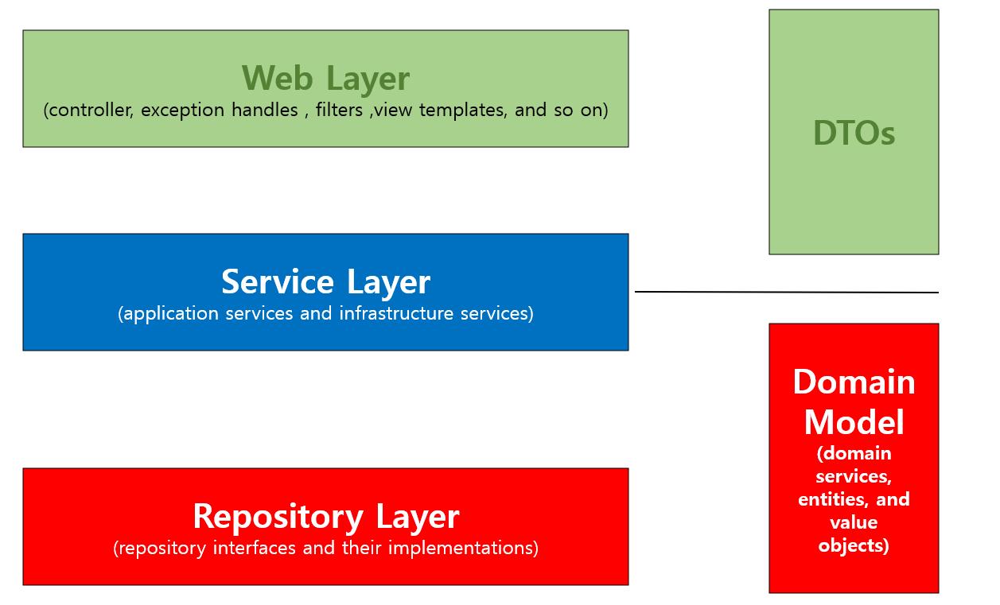

# JPA

- SQL 매퍼와 ORM

MyBatis 와 같은 SQL 매퍼를 사용하면 객체 모델링 보다는 테이블 모델링에만 집중하고
객체는 단순히 테이블에 맞추어 사용하게 된다. 그렇기 때문에 실제로 개발하는 시간보다 SQL를 다루는 시간이 더 많게 된다.

관계형 데이터베이스와 객체지향 프로그래밍의 패러다임은 서로 다르다.
JPA는 서로 다른 패더다임을 가진 위 2개의 영역을 중간에서 일치시켜 주는 기술이다.

개발자는 객체지향적으로 프로그래밍을 하고 , JPA가 이를 관계형 데이터 베이스에 맞게 SQL을 대신
생성해서 실행한다. 이로 인해 개발자는 항상 객체지향적으로 코드를 표현할 수 있고, SQL에 종속적인 개발을
하지 않아도 된다.

## Spring Data JPA
- JPA는 인터페이스로서 자바 표준 명세서이다.
- 인터페이스인 JPA를 사용하기 위해 구현체가 필요하다. 대표적으로 Hibernate, Eclipse Linke 등이 있다.
- 하지만 Spring 에서 JPA를 사용할 때 이 구현체를 직접 다루지 않는다.
- 구현체를 좀 더 쉽게 사용하기 위해 추상화 시킨 것이 Spring Data JPA 이다.

Hibernate를 쓰는 것과 Spring Data JPA를 쓰는 것 사이에는 큰 차이가 없다.
그럼에도 스프링 진영에는 Spring Data JPA 를 개발했고, 이를 권장하고 있다. 

그 이유는 다음과 같다.
- 구현체 교체의 용이성
- 저장소 교체의 용이성

`구현체 교체의 용이성` : Hibernate 외에 다른 구현체로 쉽게 교체하기 위함

Hibernate 가 언젠가 수명을 다해서 새로운 JPA 구현체가 대세로 떠오를 때, Spring Data JPA를 쓰는 중이라면
아주 쉽게 교체할 수 있다. Spring Data JPA 내부에서 구현체 매핑을 지원해주기 때문이다.
실제로 자바의 Redis 클라이언트가 Jedis 에서 Lettuce 로 대세가 넘어갈 때 
Spring Data Redis 를 쓰신 분들은 아주 쉽게 교체를 했다. 

`저장소 교체의 용이성` : 관계형 데이터베이스 외에 다른 저장소로 쉽게 교체하기 위함

서비스 초기에는 관계형 데이터베이스로 모든 기능을 처리했지만, 점점 트래픽이 많아져 관계형 데이터베이스로
도저히 감당이 안 될 때, MongoDB로 교체가 필요하다면 개발자는 Spring Data JPA에서
Spring Data MongoDB 로 의존성만 교체하면 된다.

이는 Spring Data의 하위 프로젝트들은 기본적인 CRUD 의 인터페이스가 같기 때문이다. 
즉, Spring Data JPA , Spring Data Redis , Spring Data MongoDB 등등 Spring Data 의 하위 프로젝트들은
save() , findAll , findOne() 등을 인터페이스로 갖고 있다.  그러다 보니 저장소가 교체 되어도 기본적인 기능은
변경할 것이 없다.

# Spring 웹 계층

- ## Web Layer
  - 흔히 사용하는 컨트롤러 와 JSP/Freemarker 등의 뷰 템플릿 영역
  - 필터, 인터셉터 , 컨트롤러 어드바이스 등 외부 요청과 응답에 대한 전반적인 영역

- ## Service Layer
  - @Service에 사용되는 서비스 영역
  - 일반적으로 Controller 와 Dao 의 중간 영역에서 사용
  - @Transactional 이 사용되어야 하는 영역

- ## Repository Layer
  - Database 와 같이 데이터 저장소에 접근하는 영역
  - Dao(Data Access Object) 영역으로 이해하면 됨

- ## Dtos
  - Dto(Data Transfer Object) 는 계층 간에 데이터 교환을 위한 객체를 이야기하고 , Dtos 는 이들의 영역
  - 뷰 템플릿 엔진에서 사용될 객체나 Repository Layer 에서 결과로 넘겨준 객체 등이 이에 해당

- ## Domain Model
  - 도메인이라 불리는 개발 대상을 모든 사람이 동일한 관점에서 이해할 수 있고 공유할 수 있도록 단순화 시킨 것을 도메인 모델이라고 한다.
  - 이를 테면 택시 앱이라고 하면 배차 ,탑승, 요금 등이 모두 도메인이 될 수 있다.
  - @Entity 를 사용해보신 분들은 @Entity 가 사용된 영역 역시 도메인 모델이라고 이해해주면 된다.
  - 다만, 무조건 데이터베이스의 테이블과 관계가 있어야만 하는 것은 아니다.
  - VO 처럼 값 객체들도 이 영역에 해당하기 때문

# h2

jdbc:h2:mem:testdb